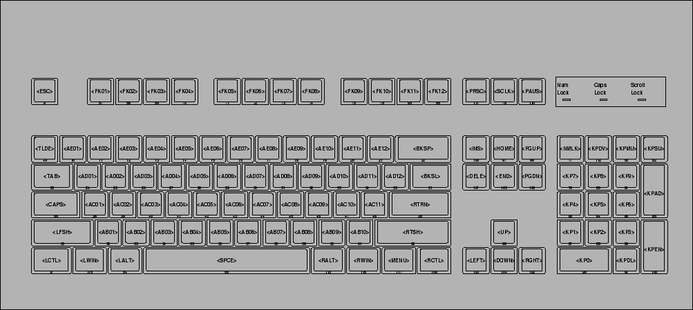

# What it does

This program lets you generate new keyboard configurations with ease just by creating layouts in textfiles.

# Getting Started

Let's make a new keyboard layout

`layouts/math_keyboard.txt`

```
|∀∃|∈∉|⊆⊇|∪∩|≤<|>≥|({|)}|⌊⌈|⌋⌉|
 |∅∗|+∑|∣∖|fg|↦⤳|xy|=≠|-±|⋅\|~≟|
  |∨∧|⇒⇐|⇔⊕|⊦⊧|∞ℵ|′∂|ℕℤ|ℚℝ|∇∫|∎≡|
```

now run 

`python keyboard_generator.py layouts/math_keyboard.txt`

this generates a file called `custom_layout` in the root directory

you then have to move it to the correct folder: 

`sudo cp custom_layout /usr/share/X11/xkb/symbols/my_custom_layout` 

# Switching between layouts

This can be done based on your desktop environment/WM, simply make some keybindings that run different commands of the form:

`setxkbmap -layout us`
`setxkbmap -layout math`
`setxkbmap -layout custom_keyboard_83`

Just be sure to have a way to get back to your standard keyboard layout, for example, in all my custom keymaps, I never rebind the space key, and super+space always takes me back to the us layout, that way I can always get back.


# More info about the layout

Here is the standard keyboard for reference:

```
|qQ|wW|eE|rR|tT|yY|uU|iI|oO|pP|
 |aA|sS|dD|fF|gG|hH|jJ|kK|lL|;:|
  |zZ|xX|cC|vV|bB|nN|mM|,<|.>|/?|
```

(where between each pair of |'s, we specify first the standard character to be bound to, and the second when holding down shift)

# Info about the script

The script generates a valid config file by taking `us_copy` which is just a copy of the default `us` layout and injects custom bindings below the standard ones. The key mapping follows this:



# Contributing

Feel free to add your own custom layouts to the layout directory as pull requests, if this ever becomes quite large we can always split the repo into two of them.

As of right now this program only modifies the standard us layout and only the three main rows of the keyboard, if you want to extend the script further feel free to do so.

Here are some features that would be nice to have:

There should be a way to specify blank keys in the layout files so that they are not overridden.

The delimiter | between the keys of the layout file should be a variable so that we can allow mappings to | without it breaking the formatting.


